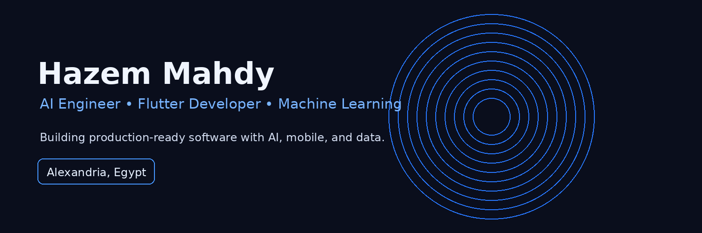

# Hi 👋, I'm Hazem Mahdy

Computer & Data Science Student • AI Engineer • Flutter Developer

---

## 💫 About Me

I build software that combines **Artificial Intelligence**, **Flutter**, and **Data Engineering**.

- 📱 16+ production Flutter applications
- 🤖 Machine Learning & Deep Learning projects
- 📊 Automated analytics over 100K+ row datasets
- 🔥 Firebase, REST APIs & Cloud Functions
- 🚀 Always learning modern software engineering

---

## 🚀 Featured Projects

- 🍔 FoodHub
- 🏢 HR Management System
- 🤖 AI Fruit Identifier
- 📊 Automated EDA Platform
- 🚗 Fleet Tracking System
- 🌐 HM Studio

---

## 🛠 Tech Stack

---

## 📈 GitHub Stats

## 🔥 Streak

## 📊 Activity Graph

## 🏆 Trophies

## 🌱 Currently Learning
- AI Agents
- LLMs
- Backend Development
- System Design

## 📜 Certifications
- IBM AI Engineering
- Google Advanced Data Analytics
- Google Data Analytics
- DEPI Cross-Platform Mobile Development

---

> **"Building software isn't just writing code—it's solving real problems with engineering."**
